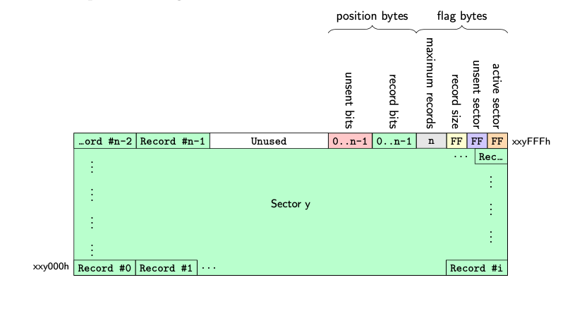

# CustoFlash
CustoFlash is a custom SPI flash library used for writing sensor data into the flash, as well as tracking whether each individual record was sent successfully via LoRaWAN before. This library is designed for MKRWAN 1310, and has only been tested on the MKRWAN 1310 2MB flash memory. It may work on other devices with the correct modifications.

This library contains modified versions of `SerialFlashChip.cpp` and `SerialFlashChip.h` by PaulStoffregen.

## 1.0.0 Usage
To use CustoFlash, we have to include the `CustoFlash.h` header. We will then call the functions with a `CustoFlash` object.
```cpp
#include "CustoFlash.h"
```

### 1.1.0 Data structure
The only structure that will normally be used with a `CustoFlash` object is `RecordAddress_t`.

#### 1.1.1 `RecordAddress_t`
**Description**:
`RecordAddress_t` structure stores the address of a written record. An address of a written record contains a sector index and record index.\
**Structure**:
```cpp
typedef struct RecordAddress {
	uint16_t sectorIndex;
	uint16_t recordIndex;
} RecordAddress_t;
```

### 1.2.0 Functions
We can access the flash memory from a `CustoFlash` object. Here are some of the functions that we can use.

#### 1.2.1 `beginWork()` and `endWork()`
**Parameter(s)**: void,\
**Return**: void,\
**Description**:\
`beginWork()` and `endWork()` are the most important functions to call before and after using the flash memory respectively. This ensures the SPI pin does not conflict with other components on the MKRWAN 1310 (eg. the LoRa modem).

**It is also required to reset the LoRa modem before using the flash memory** to avoid conflict. This can be done as below:
```cpp
pinMode(LORA_RESET, OUTPUT);
digitalWrite(LORA_RESET, LOW);
```

#### 1.2.2 `writeRecord()`
**Parameter(s)**: `const void *record` and `uint8_t recordSize`,\
**Return**: `RecordAddress_t` Address of the written record (refer 1.1.1),\
**Description**:\
`writeRecord()` is used to write a record into the flash memory. The library will decide which address is available for writing the record. The user only need to pass the pointer to the record and the size of the record in bytes. It is always recommended to use a `uint8_t` array for your records.\
**Example**:
```cpp
uint8_t record[] = { 0x30, 0x31, 0x32, 0x33, 0x34 };  //Record size = 5
CustoFlash.writeRecord(record, 5);
```

#### 1.2.3 `readRecord()`
**Parameter(s)**: `RecordAddress_t recordAddress` and `void *buf`,\
**Return**: `uint16_t` Size of the record read in bytes,\
**Description**:\
`readRecord()` is used to read record into a buffer. It is always recommended to use a `uin8_t` array as the buffer to store the record read. The buffer array size **can be larger than or equal to** the record size.\
**Example**:
```cpp
RecordAddress_t recordAddr; //To declare the record address
recordAddr.sectorIndex = 0;
recordAddr.recordIndex = 0;

uint8_t buf[255]; //255 is the largest possible size of any single written record
uint8_t recordSize = CustoFlash.readRecord(recordAddr, buf);
```

#### 1.2.4 `readRecords()`
**Parameter(s)**: `RecordAddress_t* recordAddresses`, `uint16_t length` and `void *buf`,\
**Return**: `uint16_t` Size of the records read in bytes,\
**Description**:\
`readRecords()` is similar to `readRecord()`, except that we pass in an **array of record addresses** , and it's length, into the function. `readRecords()` will read all the records given into a single buffer array. It is recommended to use `uint8_t` array as the buffer to store the records read.\
**Example**:
```cpp
uint8_t buf[255]; //can be of any size
uint16_t recordsSize = CustoFlash.readRecords(recordAddresses, 5, buf);  //in case there are 5 records
```

#### 1.2.5 `markRecordSent()`
**Parameter(s)**: `RecordAddress_t recordAddr`,\
**Return**: void,\
**Description**:\
`markRecordSent()` function will mark the record of the given address as *sent*.\
**Example**:
```cpp
RecordAddress_t recordAddr;
recordAddr.sectorIndex = 0;
recordAddr.recordIndex = 0;

CustoFlash.markRecordSent(recordAddr);
```

#### 1.2.6 `markRecordsSent()`
**Parameter(s)**: `RecordAddress_t* recordAddresses` and `uint16_t length`,\
**Return**: void,\
**Description**:\
`markRecordsSent()` will mark the array of given addresses as *sent*.\
**Example**:
```cpp
CustoFlash.markRecordsSent(recordAddresses, 5);  //suppose there are 5 addresses in recordAddresses array
```

#### 1.2.7 `markLatestWrittenRecordSent()`
**Parameter(s)**: void,\
**Return**: void,\
**Description**:\
`markLatestWrittenRecordSent()` wraps `markRecordsSent()` to mark the latest record written to the memory as sent. Using this reduces the complexity of the code as it does not require any parameter.

#### 1.2.8 `getLatestWrittenRecordSector()`
**Parameter(s)**: void,\
**Return**: `uint16_t` Sector index of the latest written record,\
**Description**:\
`getLatestWrittenRecordSector()` returns the sector index of the latest written record, which is a part of the record address. It is often used with `getLatestWrittenRecordIndex()` mentioned below.

#### 1.2.9 `getLatestWrittenRecordIndex()`
**Parameter(s)**: `uint16_t sectorIndex`,\
**Return**: `uint16_t` Record index of the latest written record of a sector,\
**Description**:\
`getLatestWrittenRecordIndex()` returns the record index of the **latest written record of a sector**. To get the latest written record, we will need to call `getLatestWrittenRecordSector()` to get the correct sector index.\
**Example**:
```cpp
//To get the latest written record address
uint16_t sectorIndex = CustoFlash.getLatestWrittenRecordSector();
uint16_t recordIndex = CustoFlash.getLatestWrittenRecordIndex(sectorIndex);
```

#### 1.2.10 `getEarliestBacklogSector()`
**Parameter(s)**: void,\
**Return**: `uint16_t` Sector index of the earliest backlog,\
**Description**:\
`getEarliestBacklogSector()` returns the sector index of the earliest backlog. **A backlog is an unsent record written in the past**. This function is often used with `getEarliestBacklogIndex()`. `getEarliestBacklogSector()` will return `NO_BACKLOG_SECTOR` when there is **no backlog in the flash memory**.

#### 1.2.11 `getEarliestBacklogIndex()`
**Parameter(s)**: `uint16_t sectorIndex`,\
**Return**: `uint16_t` Record index of the earliest backlog of a sector.\
**Description**:\
`getEarliestBacklogIndex()` returns the record index of the earliest backlog of a given sector. To get the earliest backlog of the flash memory, we will need to call `getEarliestBacklogSector()` to get the correct sector index. This function will return `NO_BACKLOG_RECORD` when there is **no backlog in the given sector**.\
**Example**:
```cpp
//To get the earliest backlog address
uint16_t sectorIndex = CustoFlash.getEarliestBacklogSector();
uint16_t recordIndex = CustoFlash.getEarliestBacklogIndex(sectorIndex);
```

#### 1.2.12 `getLatestBacklogSector()`
**Parameter(s)**: void,\
**Return**: `uint16_t` Sector index of the latest backlog,\
**Description**:\
`getLatestBacklogSector()` returns the sector index of the latest backlog. This function is often used with `getLatestBacklogIndex()`. `getLatestBacklogSector()` will return `NO_BACKLOG_SECTOR` when there is **no backlog in the flash memory**.

#### 1.2.13 `getLatestBacklogIndex()` Part 1
**Parameter(s)**: `uint16_t sectorIndex`,\
**Return**: `uint16_t` Record index of latest backlog of a sector,\
**Description**:\
There are two versions of `getLatestBacklogIndex()`, this section will talk about the one with only **one parameter**. This function will return the record index of the latest backlog in a given sector. This function will return `NO_BACKLOG_RECORD` when there is **no backlog in the given sector**.\
**Example**:
```cpp
//To get the latest backlog address
uint16_t sectorIndex = CustoFlash.getLatestBacklogSector();
uint16_t recordIndex = CustoFlash.getLatestBacklogIndex(sectorIndex);
```

#### 1.2.14 `getLatestBacklogIndex()` Part 2
**Parameter(s)**: `uint16_t sectorIndex` and `uint16_t preceding`\
**Return**: `uint16_t` Record index of latest backlog of a sector preceding a record index,\
**Description**:\
This is the second version of `getLatestBacklogIndex()`, the one with two parameters. This function returns the record index of the latest backlog in a given sector, that is before the **preceding record index**. This is useful when we want to find the next latest backlog in the same sector by calling the function 'recursively'. This function will return `NO_BACKLOG_RECORD` when there is **no backlog in the given sector, preceding a given record index**.\
**Example**:
```cpp
//To get the latest backlog address
uint16_t sectorIndex = CustoFlash.getLatestBacklogSector();
uint16_t recordIndex = CustoFlash.getLatestBacklogIndex(sectorIndex);

//To get the next latest backlog addresses of the same sector
recordIndex = CustoFlash.getLatestBacklogIndex(sectorIndex, recordIndex);
```

#### 1.2.17 `getNextBacklogAddress()`
**Parameter(s)**: `RecordAddress_t recordAddr`,\
**Return**: `uint16_t` Size of the backlog in bytes,\
**Description**:\
`getNextBacklogAddress()` reduces the complexity of getting subsequent latest backlogs across the entire flash memory. It writes the address into a `RecordAddress_t` structure.\
**Example**:
```cpp
//To get the latest backlog address
RecordAddress_t recordAddress;
uint16_t recordSize = CustoFlash.getNextBacklogAddress(recordAddress);

//To get the next latest backlog address preceding the prior one
recordSize = CustoFlash.getNextBacklogAddress(recordAddress);
```

#### 1.2.16 `retrieveLatestBacklogsAddresses()`
**Parameter(s)**: `uint8_t payloadSize` and `RecordAddress_t *addresses`,\
**Return**: `uint16_t` Length of array containing the latest backlog addresses,\
**Description**:\
`retrieveLatestBacklogsAddresses()` will retrieve the latest backlogs addresses into a `RecordAddress_t` array. Since there is a payload limit for different LoRaWAN data rates, this function will determine how many backlogs that can be sent at the same time based on the given `payloadSize`. This function is often used with `readRecords()` and `markRecordsSent()`.\
**Example**:
```cpp
//Retrieve the latest backlogs addresses
RecordAddress_t addresses[100]; //Array length can be larger than actual length
uint16_t arrayLength = CustoFlash.retrieveLatestBacklogsAddresses(64, addresses);  //Assuming we have a 64 byte payload limit via LoRaWAN

//To read the backlogs
uint8_t buf[64];
uint16_t bytesRead = CustoFlash.readRecords(addresses, arrayLength, buf);

//To mark the backlogs as unsent
CustoFlash.markRecordsSent(addresses, arrayLength);
```

#### 1.2.17 `read()`
**Parameter(s)**: `uint32_t addr`, `void *buf` and `uint32_t len`,\
**Return**: void,\
**Description**:\
This is the same `read()` function in the `SerialFlashChip` class. It reads directly from a memory address.\
**Example**:
```cpp
uint32_t memoryAddress = 0;
uint8_t buf[8]; //Suppose that we are going to read 8 bytes of data.
CustoFlash.read(memoryAddress, buf, 8);
```

#### 1.2.18 `write()`
**WARNING: THIS IS A DANGEROUS FUNCTION THAT MAY CORRUPT THE CUSTOFLASH FILESYSTEM OR CAUSE DATA LOSS. DO NOT USE THIS FUNCTION UNLESS YOU KNOW WHAT YOU ARE DOING.**

**Parameter(s)**: `uint32_t addr`, `const void *buf` and `uint32_t len`,\
**Return**: void,\
**Description**:\
This is the same `write()` function in the `SerialFlashChip` class. It writes directly into a memory address.\
**Example**:
```cpp
uint32_t memoryAddress = 0;
uint8_t buf[] = { 0x00, 0x01, 0x02, 0x03 };
CustoFlash.write(memoryAddress, buf, 4);
```

#### 1.2.19 `eraseAll()`
**WARNING: THIS IS A DANGEROUS FUNCTION THAT MAY CORRUPT THE CUSTOFLASH FILESYSTEM OR CAUSE DATA LOSS. DO NOT USE THIS FUNCTION UNLESS YOU KNOW WHAT YOU ARE DOING.**

**Parameter(s)**: void,\
**Return**: void,\
**Description**:\
This the same `eraseAll()` function in the `SerialFlashChip` class. It wipes the entire flash memory. Handle with care!

#### 1.2.20 `eraseBlock()`
**WARNING: THIS IS A DANGEROUS FUNCTION THAT MAY CORRUPT THE CUSTOFLASH FILESYSTEM OR CAUSE DATA LOSS. DO NOT USE THIS FUNCTION UNLESS YOU KNOW WHAT YOU ARE DOING.**

**Parameter(s)**: `uint32_t addr`,\
**Return**: void,\
**Description**:\
This is the same `eraseBlock()` function in the `SerialFlashChip` class. Pass the starting address of a memory block to wipe it. A memory block of the flash memory on the MKRWAN 1310 (W25Q16JV) is 65536 bytes. Handle with care!

#### 1.2.21 `eraseSector()`
**WARNING: THIS IS A DANGEROUS FUNCTION THAT MAY CORRUPT THE CUSTOFLASH FILESYSTEM OR CAUSE DATA LOSS. DO NOT USE THIS FUNCTION UNLESS YOU KNOW WHAT YOU ARE DOING.**

**Parameter(s)**: `uint32_t addr`,\
**Return**: void,\
**Description**
This is a custom made function that is added to the `SerialFlashChip` class. Pass the starting address of a memroy sector to wipe it. A memory sector of the flash memory on the MKRWAN 1310 (W25Q16JV) is 4096 bytes. Handle with care!

### 1.3.0 Some useful classes
To reduce the complexity of the code even further, there are two additional classes that can be used.

#### 1.3.1 The `SerialFlashSector` class
To construct a `SerialFlashSector` object, we must first have a `CustoFlash` object:
```cpp
uint16_t sectorIndex = 0;
SerialFlashSector sector = CustoFlash.getSector(sectorIndex);
```
Some functions that can be called from a `SerialFlashSector` object includes:
1. `bool isActive()` returns true when the sector flag is active and vice versa,
2. `bool isBlank()` returns true when the sector flag is blank and vice versa.
3. `bool verifyBlank()` returns true when sector is verified to be blanka and vice versa.
4. `uint8_t getActiveFlag()` returns sector flag of the sector.
5. `uint8_t getUnsentFlag()` returns unsent flag of the sector.
6. `uint8_t getRecordSize()` returns the size of records written in the sector.
7. `uint16_t getMaxCount()` returns the maximum number of records that can be written in the sector.
8. `uint16_t getWrittenCount()` returns the number of records written in the sector.
9. `uint16_t getUnsentCount()` returns the number of records that are unsent in the sector.

#### 1.3.2 The `SerialFlashRecord` class
To construct a `SerialFlashRecord` object, we must first have a `SerialFlashSector` object:
```cpp
uint16_t recordIndex = 0;
SerialFlashRecord record = sector.getRecord(recordIndex);
```

Some functions that can be called from a `SerialFlashRecord` object includes:
1. `bool hasBeenSent()` returns whether the record is sent or not.
2. `void markSent()` marks the record as sent.
3. `uint8_t readContent(uint8_t *record)` writes content to a `uint8_t` array, and returns the size of the record.
4. `String getHexString()` returns a `String` of the record formatted in HEX.
5. `uint8_t getRecordSize()` returns the size of the record.

## 2.0.0 The Filesystem
It may not be needed for the user to understand the underlying filesystem of the flash memory. But if you are interested, keep reading.

This library is designed to store records on a sector-by-sector basis. The sector on the MKRWAN 1310 flash memory contains 512 sectors, each 4096 bytes in size.

Below is how CustoFlash structure a sector.



The tail of the sector is divided into position bytes and flag bytes.

At the position bytes, there are two bit masks used to track the positions of record unsent records and written records in the sector.

At the flag bytes, CustoFlash stores the number of maximum records and record size of each individual record.

CustoFlash also stores the unsent state and active state of the sector at the flag bytes of the sector tail. They are used to label whether there are unsent records in the sector, or whether the sector is currently in use, respectively.
